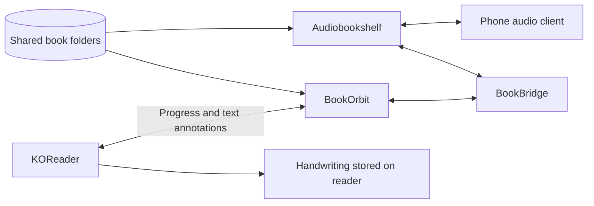

<div align="center">

# 📚 BookOrbit Reading Stack

**Your books. Your devices. Your own server.**

Native on Apple Silicon · Docker Compose on Linux · KOReader companion plugins

[](native/README.md)
[](cloud/README.md)
[](LICENSE)

[Mac setup](#-mac-quick-start) · [Linux setup](#-linux-quick-start) · [Handwriting & plugins](docs/PLUGINS.md) · [Roadmap & specification](docs/SPEC.md)

</div>

---

Bring an ebook library, audiobook server, and reading integrations together. Run native services on a Mac Mini without a Linux VM, or host the stack on a Linux server with persistent storage and HTTPS.

This is an **independent deployment kit** for [BookOrbit](https://github.com/bookorbit/bookorbit), [Audiobookshelf](https://github.com/advplyr/audiobookshelf), and [BookBridge](https://github.com/cporcellijr/bookbridge). It is not an official distribution of those projects. Their source code, books, proprietary fonts, and personalized plugins are not bundled.

## What you get

| Capability | Included today |
|---|---|
| Ebook library | BookOrbit with watched folders |
| Audiobook listening | Audiobookshelf, with compatible phone clients |
| KOReader progress and text annotations | BookOrbit's upstream companion plugin; configure separately |
| Reading/audio integration | BookBridge; pairing and alignment still require setup |
| Handwriting over EPUBs | Optional Stylus Annotations plugin; device/layout limitations apply |
| PDF handwriting and export | Optional Ink Away plugin |
| Handwriting in BookOrbit or on iPhone | **Planned**; strokes currently stay on the reader |
| On-demand Kokoro narration | **Planned**; no TTS engine is installed by this kit |



> **Validation:** Native services and server-side audio requests were exercised on the original Apple Silicon installation. A fresh-machine install has not yet been independently reproduced. Linux Compose has static validation only. Phone lock-screen playback, audiobook alignment, and device-specific pen behavior need real-device testing. See [validation](docs/VALIDATION.md).

## 🍎 Mac quick start

Requires **Apple Silicon macOS**, [Homebrew](https://brew.sh), Apple's command-line tools (`xcode-select --install`), and a logged-in desktop account. Choose a permanent folder: launchd uses its absolute path. Only one native installation per macOS user is supported by the fixed service labels and ports.

Download this repository using **Code → Download ZIP**, extract it, and open Terminal in the extracted folder:

```sh
cd native
bash install.sh
```

The installer fetches pinned upstream revisions, builds the apps, generates private secrets, initializes PostgreSQL, and registers services to start after login. It installs Node.js, Python, PostgreSQL/pgvector, FFmpeg, and Poppler through Homebrew. Initial builds require internet access and disk space.

Wait until the services are ready, then create the first accounts and connect them:

```sh
venv/bin/python onboard.py you@example.com
python3.11 manage.py stop bookbridge
python3.11 manage.py start bookbridge
# After BookBridge is ready:
venv/bin/python connect.py
python3.11 manage.py status
```

Use your own email. Run automated onboarding **before** manually creating accounts. Generated passwords are stored locally in `native/config/accounts.json`; each service has its own login. Existing installations should follow [the detailed Mac guide](native/README.md), rather than rerunning setup in a second folder.

| Open on your Mac | Address |
|---|---|
| BookOrbit | http://localhost:3000 |
| Audiobookshelf | http://localhost:13378/audiobookshelf |
| BookBridge | http://localhost:5757 |

For a phone or reader, use your Mac's LAN address instead of `localhost`. Set BookOrbit's `APP_URL` in `native/config/bookorbit.json` to a device-reachable address and restart BookOrbit if generated links point to localhost. Use a private VPN such as [Tailscale](https://tailscale.com) away from home. Do not port-forward these native HTTP services directly to the internet.

## 🐧 Linux quick start

Requires a Linux host with [Docker Engine and Compose](https://docs.docker.com/engine/install/), Python 3, persistent disk, and a domain. Linux uses containers; this kit does not yet provide a native Linux/systemd installer.

Point `books.example.com`, `audio.example.com`, and `bridge.example.com` at the server. Allow TCP 80/443 for Caddy and HTTPS. From the repository folder:

```sh
cd cloud
sudo python3 prepare.py --domain example.com --email you@example.com
sudo sh deploy.sh
```

Replace the example domain and email. Open each subdomain and complete first-run account creation. Configure BookOrbit's libraries at `/books/books` and `/books/comics`, and Audiobookshelf's at `/audiobooks`.

The Linux guide covers [service connections, backups, image pinning, and Railway limitations](cloud/README.md). The current Compose configuration is **not a one-click Railway template** and has not been deployed on a remote host during validation.

## Add books, then take them with you

| Installation | Host folder |
|---|---|
| Mac | `native/library/books/` |
| Linux | `cloud/storage/library/books/` |

EPUBs may be copied directly into the watched books folder. Keep each audiobook in a separate title folder, especially multi-file MP3 books. Matching EPUB/audio pairs can share a title folder:

```text
books/
├── A Novel.epub
└── Author/
    └── Another Book/
        ├── Another Book.epub
        ├── 01.mp3
        └── 02.mp3
```

Reading text does not require BookBridge alignment. Switching between a narrated audiobook and an EPUB does: connect and pair the editions before expecting cross-format progress to work.

For listening, choose an [Audiobookshelf-compatible client](https://www.audiobookshelf.org/). [Prologue](https://prologue.audio/) is an iPhone option; check current compatibility and pricing. Download audio before a walk for offline use. KOReader itself has no iOS app; an iPhone reading client is a separate choice.

## ✍️ Write on your books

Use **Stylus Annotations for EPUB handwriting** or **Ink Away for PDF annotation and notebooks**. They are optional third-party plugins, installed on the reader, not on the Mac server.

Follow the [plugin guide](docs/PLUGINS.md) for downloads, folder layouts, menu paths, and backup/export limitations. Handwriting sync and a gallery of exported passages are recorded in the [specification TODO list](docs/SPEC.md).

## Maintain your library

```sh
# From native/ on a Mac:
python3.11 manage.py status
python3.11 backup.py
# Optional: nightly settings backups and prevent idle sleep
python3.11 maintenance.py
```

Mac settings backups exclude books; back up the media folder separately. Linux `cloud/backup.sh` includes media and briefly stops the applications. Both backup formats contain secrets: keep them private. Reader handwriting needs a separate device backup.

## Project map

```text
native/       Native Apple Silicon installer and service helpers
cloud/        Linux Compose stack with Caddy HTTPS
docs/        Plugin guide, implementation specification, validation
scripts/      Public-tree checks and deployment smoke tests
```

## Contributing & credits

Start with [CONTRIBUTING.md](CONTRIBUTING.md) and the [specification](docs/SPEC.md). Do not submit books, runtime data, personal plugin packages, or credentials.

Built around the work of the BookOrbit, Audiobookshelf, BookBridge, KOReader, Stylus Annotations, Ink Away, PostgreSQL/pgvector, and Caddy communities. See [THIRD_PARTY.md](THIRD_PARTY.md). The MIT license here covers this repository's original deployment helpers and documentation; upstream projects retain their own licenses.
