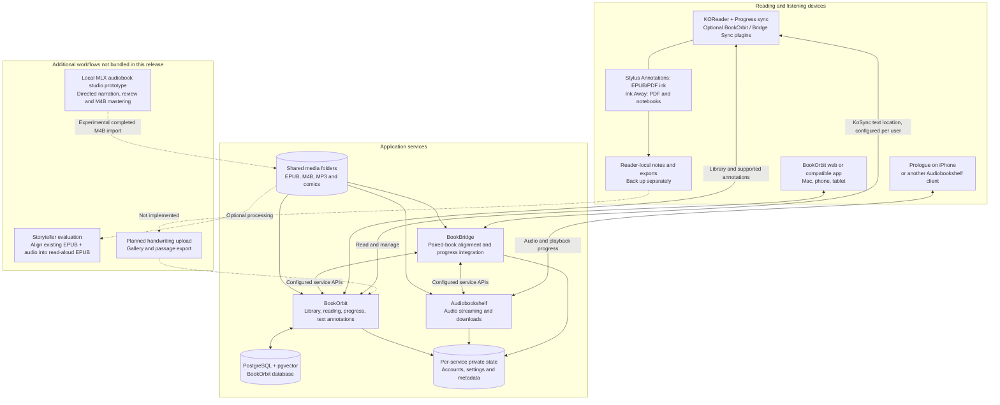
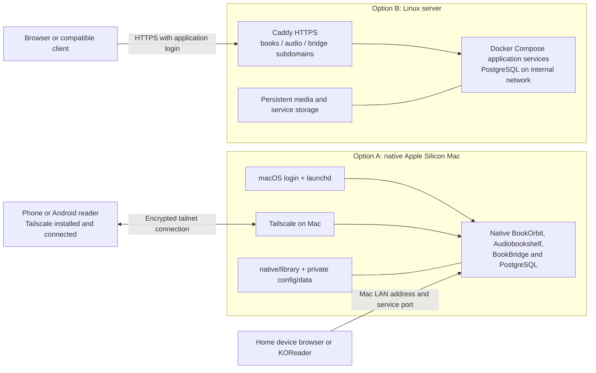
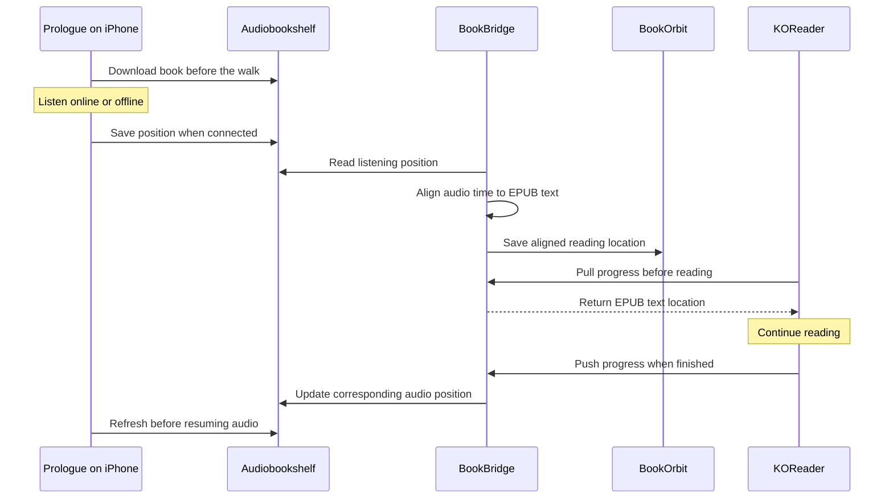

<div align="center">

# 📚 BookOrbit Reading Stack

**Your books. Your devices. Your own server.**

Native on Apple Silicon · Docker Compose on Linux · KOReader companion plugins

[](native/README.md)
[](cloud/README.md)
[](LICENSE)

[Listen to the demo](#listen-to-the-sample) · [Walk-and-read guide](#read--walk-and-listen--keep-reading) · [Mac setup](#-mac-quick-start) · [Linux setup](#-linux-quick-start) · [Remote access](#remote-access-with-tailscale) · [Handwriting & plugins](docs/PLUGINS.md) · [Reading profiles](#kindle-reader-profile-and-device-transfer) · [Roadmap & specification](docs/SPEC.md)

</div>

---

Bring an ebook library, audiobook server, and reading integrations together. Run native services on a Mac Mini without a Linux VM, or host the stack on a Linux server with persistent storage and HTTPS.

This is an **independent deployment kit** for [BookOrbit](https://github.com/bookorbit/bookorbit), [Audiobookshelf](https://github.com/advplyr/audiobookshelf), and [BookBridge](https://github.com/cporcellijr/bookbridge). It is not an official distribution of those projects. Their source code, full books, proprietary fonts, and personalized plugins are not bundled. A short narrated demonstration excerpt is included below.

## Listen to the sample

[▶ Listen to the two-minute Marvin sample](https://raw.githubusercontent.com/seshakiran/bookorbit-reading-stack/main/assets/audio/marvin-reading-handoff-sample.mp3) · [View/download the MP3](assets/audio/marvin-reading-handoff-sample.mp3)

An original synthetic narrator reads an excerpt from *History of Physics* by Jordan Maxwell, with a brisk six-second musical cue and a short, clearly separated reflection. Soft beeps identify the commentary; the book continues after a complete paragraph. The sample demonstrates narration and transitions, not a recording of a device handoff. Your browser may play the MP3 directly or download it.

The full recording and the experimental MLX studio are not bundled. See [attribution and sample scope](THIRD_PARTY.md). No account or server is needed to hear the sample.

## What you get

| Capability | Included today |
|---|---|
| Ebook library | BookOrbit with watched folders |
| Audiobook listening | Audiobookshelf, with compatible phone clients |
| KOReader progress and text annotations | BookOrbit's upstream companion plugin; configure separately |
| Reading/audio integration | BookBridge; pairing and alignment still require setup |
| Handwriting over EPUBs | Optional Stylus Annotations plugin; device/layout limitations apply |
| PDF handwriting and export | Optional Ink Away plugin |
| Handwriting in BookOrbit or on iPhone | **Planned**; strokes currently stay on the reader |
| On-demand Kokoro narration | **Planned**; no TTS engine is installed by this kit |

## Architecture

The same application stack has two deployment choices: native processes on a Mac, or containers on Linux. The diagrams describe supported connections; they do not imply that every integration is configured automatically.



Solid lines show the existing components and integration paths; dashed lines show optional or future additions. Text highlights and typed notes can sync through the BookOrbit plugin. Handwritten strokes currently stay on the reader. A local MLX experiment produced a full chaptered M4B and the public sample above; its studio code and model weights are not included in this deployment kit. BookBridge pairing, alignment and server-side progress transfer were exercised separately. On-demand Kokoro and easier profile transfer remain future work. See the [production specification](docs/SPEC.md#p0--local-audiobook-production) for the chapter-by-chapter workflow and acceptance checks.



Tailscale supplies private network access, not application login or book synchronization. The native HTTP endpoints are reached through the encrypted tailnet when remote. Linux's public HTTPS deployment is a separate option and still requires destination testing.

> **Validation:** Native services and server-side audio requests were exercised on the original Apple Silicon installation. A fresh-machine install has not yet been independently reproduced. Linux Compose has static validation only. The originating installation completed audiobook alignment and server-side handoff, and Prologue connectivity was reported working. Phone offline/lock-screen behavior and the full e-reader round trip still need device testing. See [validation](docs/VALIDATION.md).

## 🍎 Mac quick start

Requires **Apple Silicon macOS**, [Homebrew](https://brew.sh), Apple's command-line tools (`xcode-select --install`), and a logged-in desktop account. Choose a permanent folder: launchd uses its absolute path. Only one native installation per macOS user is supported by the fixed service labels and ports.

Download this repository using **Code → Download ZIP**, extract it, and open Terminal in the extracted folder:

```sh
cd native
bash install.sh
```

The installer fetches pinned upstream revisions, builds the apps, generates private secrets, initializes PostgreSQL, and registers services to start after login. It installs Node.js, Python, PostgreSQL/pgvector, FFmpeg, and Poppler through Homebrew. Initial builds require internet access and disk space.

Wait until the services are ready, then create the first accounts and connect them:

```sh
venv/bin/python onboard.py you@example.com
python3.11 manage.py stop bookbridge
python3.11 manage.py start bookbridge
# After BookBridge is ready:
venv/bin/python connect.py
python3.11 manage.py status
```

Use your own email. Run automated onboarding **before** manually creating accounts. Generated passwords are stored locally in `native/config/accounts.json`; each service has its own login. Existing installations should follow [the detailed Mac guide](native/README.md), rather than rerunning setup in a second folder.

| Open on your Mac | Address |
|---|---|
| BookOrbit | http://localhost:3000 |
| Audiobookshelf | http://localhost:13378/audiobookshelf |
| BookBridge | http://localhost:5757 |

### Reach the Mac from another device

`localhost` always means the device you are currently using. On your phone or reader, it does **not** mean the Mac. Use these templates, replacing the uppercase placeholders with your own addresses; no real device addresses are published here.

| Connection | BookOrbit | Audiobookshelf |
|---|---|---|
| On the server Mac | `http://localhost:3000` | `http://localhost:13378/audiobookshelf` |
| Home network | `http://MAC_LAN_ADDRESS:3000` | `http://MAC_LAN_ADDRESS:13378/audiobookshelf` |
| Private remote access | `http://MAC_TAILSCALE_ADDRESS:3000` | `http://MAC_TAILSCALE_ADDRESS:13378/audiobookshelf` |

Find the LAN address under **macOS System Settings → Network → active connection → Details → TCP/IP**. A router DHCP reservation can keep it stable. Devices on guest Wi-Fi may be isolated even when connected to the same router.

### Remote access with Tailscale

1. Install and connect [Tailscale on the Mac](https://tailscale.com/docs/install/mac).
2. Install Tailscale on **each client** that needs remote access: [Android](https://tailscale.com/docs/install/android) for a compatible reader, or the official iOS app for an iPhone. Sign in to the same tailnet and approve the client VPN prompt. Installing it only on the Mac is insufficient.
3. Find the Mac in Tailscale's device list and copy its Tailscale address. Keep it private. Tailnet policy must permit the client to reach the chosen service port.
4. On the client, first open `http://MAC_TAILSCALE_ADDRESS:3000` in its browser. Once the login page opens, configure the reader/app with that same base URL. Keep `http://` for this native configuration; enabling Tailscale does not automatically configure HTTPS on port 3000.
5. In KOReader: **open a book → top-center menu → crossed-tools tab → BookOrbit → Account & setup → BookOrbit server address**. Enter `http://MAC_TAILSCALE_ADDRESS:3000`. Keep your existing KOReader integration credentials. They are managed in BookOrbit's KOReader settings and may differ from your normal web login.
6. Use the audio address above and your **Audiobookshelf** credentials in the phone's audiobook client. Each service has its own account.

The Tailscale address can be used at home and away as long as both ends stay connected. For this connection you do not need an exit node, router port forwarding, Tailscale Funnel, or a public domain. See [Tailscale's remote media guide](https://tailscale.com/docs/use-cases/personal-or-at-home-use/access-nas-media-file-servers?tab=android).

These Android instructions do not imply that stock Kindle/Kobo devices can install the Android Tailscale app. Devices without a supported Tailscale client need a separately planned network gateway or HTTPS access path.

### Generated links and Mac availability

Edit **only** `APP_URL` in the private `native/config/bookorbit.json` to the base address that your intended clients can reach, such as `http://MAC_TAILSCALE_ADDRESS:3000`. Preserve all existing secrets and other settings. Then, from `native/`:

```sh
python3.11 manage.py stop bookorbit
python3.11 manage.py start bookorbit
python3.11 manage.py status
```

`APP_URL` affects generated links; it does not install Tailscale, change firewall rules, or update an already-provisioned reader's server address. Keep Tailscale enabled for clients using that address. Personalized KOReader plugin downloads can contain credentials and must never be shared publicly.

Keep the Mac **powered, awake, online, and logged in**. This installer uses per-user LaunchAgents: after a restart, log into macOS before expecting the applications to serve books. You can lock the screen afterward. The optional `python3.11 maintenance.py` enables idle-sleep prevention and nightly settings backups; it cannot keep a shut-down Mac online or bypass FileVault login. See [Mac maintenance](native/README.md#service-controls) and [Tailscale session behavior](https://tailscale.com/docs/how-to/run-unattended).

### If KOReader cannot connect

| What happens | Next check |
|---|---|
| Mac cannot open `http://localhost:3000` | Run `manage.py status` and `manage.py logs bookorbit` from `native/`. Check PostgreSQL too. |
| Mac works, reader browser cannot open the LAN URL | Verify the current Mac address, reader Wi-Fi, guest/client isolation, and firewall permission for the service. Do not disable the firewall as a default fix. |
| Tailscale URL fails in the reader browser | Confirm both clients show connected, the Mac is awake, the tailnet is the same, access policy permits the port, and another VPN is not replacing Tailscale. |
| Reader browser works, KOReader fails | Check the plugin's exact server URL, scheme and port; then capture its error. Browser success does not verify plugin authentication. |
| HTTP 401 or a login failure | Check the integration credentials; resetting the network will not fix an authentication error. |

A successful request on the Mac proves the server responds there. It does not prove another device can reach it. Test from the failing device before changing server settings. Do not port-forward the native HTTP services directly to the internet.

## 🐧 Linux quick start

Requires a Linux host with [Docker Engine and Compose](https://docs.docker.com/engine/install/), Python 3, persistent disk, and a domain. Linux uses containers; this kit does not yet provide a native Linux/systemd installer.

Point `books.example.com`, `audio.example.com`, and `bridge.example.com` at the server. Allow TCP 80/443 for Caddy and HTTPS. From the repository folder:

```sh
cd cloud
sudo python3 prepare.py --domain example.com --email you@example.com
sudo sh deploy.sh
```

Replace the example domain and email. Open each subdomain and complete first-run account creation. Configure BookOrbit's libraries at `/books/books` and `/books/comics`, and Audiobookshelf's at `/audiobooks`.

The Linux guide covers [service connections, backups, image pinning, and Railway limitations](cloud/README.md). The current Compose configuration is **not a one-click Railway template** and has not been deployed on a remote host during validation.

## Add books, then take them with you

| Installation | Host folder |
|---|---|
| Mac | `native/library/books/` |
| Linux | `cloud/storage/library/books/` |

EPUBs may be copied directly into the watched books folder. Keep each audiobook in a separate title folder, especially multi-file MP3 books. Matching EPUB/audio pairs can share a title folder:

```text
books/
├── A Novel.epub
└── Author/
    └── Another Book/
        ├── Another Book.epub
        ├── 01.mp3
        └── 02.mp3
```

Reading text does not require BookBridge alignment. Switching between a narrated audiobook and an EPUB does: connect and pair the editions before expecting cross-format progress to work.

## Read → walk and listen → keep reading

BookOrbit is the ebook library; Audiobookshelf is the audio server; **Prologue** is an iPhone listening client; **BookBridge** translates the listening position into an EPUB location; **KOReader** receives that location on the e-reader. A book appearing in both libraries does not automatically connect its progress.



### 1. Put the ebook and audiobook in your library

1. Copy the EPUB and its matching M4B or MP3 files into the [watched media folder](#add-books-then-take-them-with-you). Use a separate folder for each audiobook.
2. Open BookOrbit and confirm that the EPUB is readable. Open Audiobookshelf and confirm that the audiobook plays and has sensible chapter markers. Allow the library scanners to finish; rescan if the title is missing.
3. Use the **same EPUB edition and file** on KOReader that you select for alignment. An abridged recording, different edition, or edited EPUB can produce mismatches.
4. Keep that file unchanged after pairing. If you replace an edition or recording, update the mapping and rebuild alignment.

### 2. Know which account signs in where

| Where you are signing in | Credentials to use |
|---|---|
| BookOrbit website | Your BookOrbit account |
| Audiobookshelf website | Your Audiobookshelf account |
| Prologue → Audiobookshelf server | The same Audiobookshelf account used by BookBridge |
| BookBridge website | Your BookBridge account |
| KOReader → Progress sync | The KoSync username/password configured under your BookBridge account |
| KOReader → BookOrbit companion plugin | The integration credentials configured in BookOrbit; these may differ from its website login |

For a native installation created with this kit, initial application credentials are stored **privately on the server** in `native/config/accounts.json`. Open that file locally when needed; do not commit it or post a screenshot. There is no shared demo login, and the services do not automatically share passwords. If you change a service password or revoke its API token, retest the corresponding BookBridge connection.

### 3. Make the server reachable from your phone and reader

1. Follow [Remote access with Tailscale](#remote-access-with-tailscale). Keep the Mac awake, logged in, and running the services. Tailscale must also be connected on each supported client that uses the private address.
2. Replace `MAC_TAILSCALE_ADDRESS` below with your own Mac's address. These are templates, not working public endpoints.
3. Open the relevant login page in the client device's browser first. Do not use `localhost` on the phone or e-reader.

| Service | Native Mac address from a remote client |
|---|---|
| BookOrbit | `http://MAC_TAILSCALE_ADDRESS:3000` |
| Audiobookshelf / Prologue server | `http://MAC_TAILSCALE_ADDRESS:13378/audiobookshelf` |
| BookBridge / KOReader sync server | `http://MAC_TAILSCALE_ADDRESS:5757` |

For Linux Compose with the supplied proxy, use your configured `https://books.example.com`, `https://audio.example.com`, and `https://bridge.example.com` instead. That deployment uses separate subdomains; do not blindly append the native Mac ports or `/audiobookshelf` prefix. A reader without Tailscale needs a reachable LAN address at home or a separately configured remote access path.

### 4. Connect Prologue on your iPhone

1. Install [Prologue](https://prologue.audio/). Its current release supports Audiobookshelf, background listening and offline downloads; check the current App Store feature/pricing details. KOReader itself is not an iPhone app.
2. In Prologue, add a server and select **Audiobookshelf**. Button wording can vary by release.
3. Enter the complete Audiobookshelf server address from the table, including `/audiobookshelf` for this native Mac setup.
4. Sign in with your **Audiobookshelf username and password**, not your BookOrbit or BookBridge login.
5. Open the library, find the audiobook, and play a short passage. Check chapter navigation and adjust the player's speed to your preference.
6. Download the book and wait for the download to finish. Test playback with the screen locked; then briefly test offline playback before relying on it for a walk.

Use the same Audiobookshelf user in Prologue and BookBridge: playback progress belongs to a user, not just to a book. Offline playback does not immediately send progress to the server.

### 5. Configure BookBridge and pair the editions

1. Open BookBridge and sign in. Under **Settings**, enable Audiobookshelf, BookOrbit and KOReader/KoSync. Set reachable **server-side** URLs. On the native Mac these can be `http://127.0.0.1:13378/audiobookshelf` and `http://127.0.0.1:3000`; container deployments need their appropriate internal service URLs.
2. Open **Account → My Integrations** (also available at `/account/integrations`). Configure Audiobookshelf with the API credential for the user you use in Prologue, and BookOrbit with your ebook account. To create an Audiobookshelf key, open its web interface as an administrator, choose **Settings → API Keys → New API Key**, give it a name such as `BookBridge`, select the **same user as Prologue**, submit, and copy the generated key into BookBridge. Keep this key private. Use the connection-test controls to verify both integrations.
3. In that same account's **KOReader / KoSync** integration, enable it and choose a private KoSync username/password. These are what you will enter on the reader.
4. In the global **Settings → KOReader/KoSync** section, select the **built-in KoSync server**. Confirm that **Target KOSync URL** is populated. For this native Mac installation, the bridge's internal relay URL is `http://127.0.0.1:5757`. Leaving it blank can allow reader authentication while preventing the bridge's sync client from writing positions. Use the deployment's built-in URL for Linux; this internal address is different from the address entered on a remote reader.
5. Open **Add / Update Book**, search for your title, select the **Audiobookshelf audiobook**, and select the **BookOrbit EPUB**. Skip Storyteller unless you separately use it. Do not select “No audio” or an audio-only mapping for this workflow.
6. Add that pair to the queue, then choose **Match All / process queue**. Review the queue so it contains only the books you intend to pair. Labels differ slightly between versions.
7. Wait for transcription/alignment to finish and the book to become **active**. This is background processing; adding a pair to the queue is not completion. Read the error/quality information if it fails.
8. Run the book's **Sync now** action and check its saved progress. Alignment should translate listening time into a text location, not blindly copy the audiobook percentage into the EPUB.

Music, opening credits and added narrator commentary have no equivalent words in the EPUB. Test positions immediately before and after those additions; alignment quality scores are diagnostics, not a guarantee of sentence-perfect handoff. The local demonstration completed full-book alignment and successfully transferred real listening progress into BookOrbit and a retrievable KoSync text locator. A reader-device round trip still needs testing on your installation.

Upstream reference: [BookBridge getting started and KOReader setup](https://github.com/cporcellijr/bookbridge/blob/main/docs/getting-started.md).

### 6. Connect KOReader on the e-reader

1. Open the matching EPUB in KOReader. Tap the top-center area to open the menu, then select the **Tools / crossed-tools tab → Progress sync**. Menu placement can vary by KOReader release.
2. Set **Custom sync server** to `http://MAC_TAILSCALE_ADDRESS:5757` for remote access to the native Mac. Enter the base address only—do not add `/api` or `/koreader`. Use your reachable HTTPS bridge address for a proxy deployment.
3. Choose **Login**, using the **KoSync credentials from BookBridge My Integrations**. Do not use Register to create an unrelated account.
4. **Pull progress from the server first**, before pushing an old device position. Confirm that you land near the passage you last heard.
5. Enable automatic progress synchronization once that first pull works. At the end of a reading session, push progress or confirm that automatic sync has completed before switching devices.
6. If the book is not recognized, check **BookBridge → Add / Update Book → Reader Documents** and link the document reported by the reader to the correct mapping. Do not guess that two similarly named EPUBs have the same document identity.

The optional **Bridge Sync** KOReader plugin is available under **BookBridge → Account → Connect a KOReader device**. It can deliver the paired EPUB unchanged and adds further device integrations. The built-in KOReader **Progress sync** feature is sufficient for position sync; another plugin is not required just to test the handoff. Keep the BookOrbit plugin for its library and supported annotation functions. Avoid having multiple integrations independently overwrite the same reading position; use this bridge as the chosen progress-sync route and test your configuration.

### 7. Before, during and after the walk

**Before leaving**

1. If you were reading on the e-reader, close/save the book and let KOReader push its latest position.
2. Let BookBridge sync, then refresh Prologue and check the starting passage. Do not resume an old cached position without checking it.
3. Confirm the audiobook download is complete and your headphones/lock-screen controls work.

**During the walk**

1. Listen in Prologue. Change speed, pause, or use a bookmark as needed.
2. If you lose connectivity, a downloaded audiobook can continue playing. Its new position reaches the other services only after synchronization reconnects.

**When you return to reading**

1. Pause Prologue. Reconnect the phone to the server and allow playback progress to upload. Open Audiobookshelf if you need to confirm the saved position.
2. Allow BookBridge's normal cycle—**up to five minutes by default**—or use **Sync now** for the mapped book. Instant sync may be quicker where supported.
3. Connect the e-reader, open that same EPUB, and **pull progress**. Check the nearby sentence before continuing.
4. At the end of reading, push the new position. Before the next listening session, let the bridge sync and refresh Prologue again.

Test with a short passage before a long outing: listen, pause, pull on KOReader, read a little farther, push, and resume audio. Page numbers can differ by font and screen; compare the passage, not the page number.

### If the handoff does not work

| Symptom | Check |
|---|---|
| Phone cannot connect | Complete server URL, Mac awake, services running, Tailscale on both ends, network policy; no `localhost` on the phone |
| Login fails | Correct service's account; Prologue uses Audiobookshelf credentials, KOReader uses configured KoSync credentials |
| Reader login works but no position arrives | Built-in KoSync target URL is populated; book mapping is active; matching document identity; a text locator exists |
| Book absent from Prologue | Audiobookshelf scan/import, correct library and user, refresh client |
| Progress stays at the pre-walk position | Offline progress has uploaded, same Audiobookshelf user in Prologue and the bridge, wait for sync or run Sync now |
| Wrong passage after pulling | Same EPUB edition; alignment quality; added/nonmatching audio; correct Reader Documents link |
| Position jumps between devices | Pause the first device, finish syncing, then pull on the next; check for competing progress integrations |

Never reset progress or recreate a working account as the first troubleshooting step. Check the mapped book's state and service connection tests first.

## ✍️ Write on your books

Use **Stylus Annotations for EPUB handwriting** or **Ink Away for PDF annotation and notebooks**. They are optional third-party plugins, installed on the reader, not on the Mac server.

Follow the [plugin guide](docs/PLUGINS.md) for downloads, folder layouts, menu paths, and backup/export limitations. Handwriting sync and a gallery of exported passages are recorded in the [specification TODO list](docs/SPEC.md).

## Kindle Reader profile and device transfer

**Kindle Reader** is the example profile name used here for a Kindle-like appearance, including Bookerly. It is a user-created KOReader profile, not an Amazon integration or a bundled preset. Capture your own preferred font size, margins and spacing; no personal configuration or font files are shipped in this repository.

### Defaults versus profiles

**Document Settings → save current settings as defaults** sets the starting appearance for newly opened books. Previously opened books can retain their saved appearance; use the document-settings option to reset their appearance to the current defaults when needed. Saving defaults does not create a named profile or `profiles.lua`.

A profile is a reusable group of settings that you can apply explicitly or automatically. See the [KOReader appearance and backup guide](https://koreader.rocks/user_guide/).

### Find and create a profile

1. Open an EPUB and adjust its appearance, including Bookerly and embedded-font preferences.
2. Tap the top-center, then the **crossed wrench/screwdriver icon** (Tools, usually the fourth tab). Page through the list to **Profiles**.
3. If absent: **Tools → More tools → Plugin management → Profiles**; enable it and restart.
4. Choose **Profiles → New with current book settings**, and name it **Kindle Reader**.
5. Apply it with **Profiles → Kindle Reader → Execute**.

### Apply automatically, update, or switch

- **All EPUBs as they open:** Kindle Reader → **Auto-execute → on book opening → if book file path contains** → `.epub`. Leave the new-books-only condition off to include previously opened EPUBs. This applies on opening, not as an immediate bulk rewrite of every book.
- **Edit saved values:** Kindle Reader → **Edit actions**; adjust the relevant settings and execute the profile to check them.
- **Capture a revised book layout:** adjust an open book, then create **New with current book settings** as **Kindle Reader v2**. Test it before replacing the old profile. Changing a book's appearance alone does not update the saved profile.
- **Switch:** execute another profile. Disable overlapping auto-execute rules so the previous profile does not return on reopening.
- **Rename or keep variants:** use the profile's **Rename** or **Duplicate** option. For example, keep separate **Kindle Reader — Device A** and **Kindle Reader — Device B** profiles.

Menu labels can vary by release. These instructions follow [KOReader's Profiles plugin](https://github.com/koreader/koreader/blob/master/plugins/profiles.koplugin/main.lua). Appearance changes can shift existing EPUB handwriting; test on an unannotated book first.

### Transfer between two devices with LocalSend

[LocalSend](https://localsend.org/) transfers files over the local network and supports Android and macOS. Install it on both Android readers through its official download links, connect both to the same home Wi-Fi, and keep the apps open. Guest-network isolation can prevent device discovery.

1. **Fully exit KOReader on both readers** so settings are saved and cannot overwrite your copied files.
2. On the source device, open LocalSend → **Send → Files** and select `koreader/settings/profiles.lua`. Choose the destination device and accept the transfer there. Solid Explorer can help locate the source file.
3. Also transfer the font files used by the profile from `koreader/fonts/`, and any required custom files from `koreader/styletweaks/`.
4. On the destination device, install KOReader, open it once, and exit. Locate its actual data directory; on many Android installations this is `Internal Storage/koreader`, but paths and permissions can differ.
5. Using the destination device’s file manager or Solid Explorer, move the received files from LocalSend's destination into the matching folders below. **Back up an existing `profiles.lua` first: replacing it replaces all saved profiles, not just Kindle Reader.**
6. Restart KOReader, open an EPUB, and execute **Kindle Reader**. Configure the auto-execute rule again on the destination device; the trigger configuration is stored separately from `profiles.lua`.

```text
koreader/
├── settings/
│   └── profiles.lua
├── fonts/
│   └── your Bookerly font files
└── styletweaks/
    └── any custom tweaks you use
```

There is no dedicated export button in the profile menu described here: copying `settings/profiles.lua` transfers the saved profile definitions. If that file is missing, create a named profile and exit KOReader before looking again. Re-transfer after later edits; LocalSend is a file transfer, not automatic profile synchronization.

Start with the same KOReader version on both devices where possible. Screen size and density differ, so verify margins and font size on the destination device. Install compatible handwriting plugins separately and configure BookOrbit and Tailscale on that device. Avoid copying the entire settings folder just to transfer appearance: it can include private integration settings and device-specific preferences.

Book progress and handwriting are separate from this appearance profile. Back up the books' metadata/sidecar folders separately. Keep personal profile bundles and licensed fonts out of public GitHub uploads.

## Maintain your library

```sh
# From native/ on a Mac:
python3.11 manage.py status
python3.11 backup.py
# Optional: nightly settings backups and prevent idle sleep
python3.11 maintenance.py
```

Mac settings backups exclude books; back up the media folder separately. Linux `cloud/backup.sh` includes media and briefly stops the applications. Both backup formats contain secrets: keep them private. Reader handwriting needs a separate device backup.

## Project map

```text
native/       Native Apple Silicon installer and service helpers
cloud/        Linux Compose stack with Caddy HTTPS
docs/         Plugin guide, implementation specification, validation
scripts/      Public-tree checks and deployment smoke tests
```

## Contributing & credits

Start with [CONTRIBUTING.md](CONTRIBUTING.md) and the [specification](docs/SPEC.md). Do not submit books, runtime data, personal plugin packages, or credentials.

Built around the work of the BookOrbit, Audiobookshelf, BookBridge, KOReader, Stylus Annotations, Ink Away, PostgreSQL/pgvector, and Caddy communities. See [THIRD_PARTY.md](THIRD_PARTY.md). The MIT license here covers this repository's original deployment helpers and documentation; upstream projects retain their own licenses.
