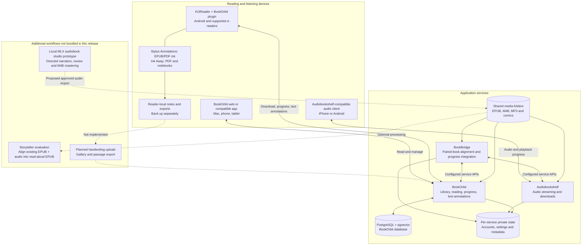
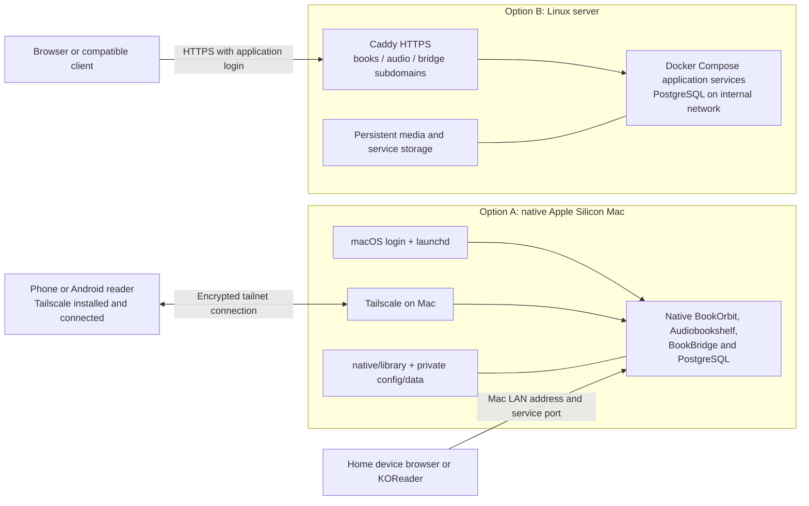

<div align="center">

# 📚 BookOrbit Reading Stack

**Your books. Your devices. Your own server.**

Native on Apple Silicon · Docker Compose on Linux · KOReader companion plugins

[](native/README.md)
[](cloud/README.md)
[](LICENSE)

[Mac setup](#-mac-quick-start) · [Linux setup](#-linux-quick-start) · [Remote access](#remote-access-with-tailscale) · [Handwriting & plugins](docs/PLUGINS.md) · [Reading profiles](#kindle-reader-profile-and-device-transfer) · [Roadmap & specification](docs/SPEC.md)

</div>

---

Bring an ebook library, audiobook server, and reading integrations together. Run native services on a Mac Mini without a Linux VM, or host the stack on a Linux server with persistent storage and HTTPS.

This is an **independent deployment kit** for [BookOrbit](https://github.com/bookorbit/bookorbit), [Audiobookshelf](https://github.com/advplyr/audiobookshelf), and [BookBridge](https://github.com/cporcellijr/bookbridge). It is not an official distribution of those projects. Their source code, books, proprietary fonts, and personalized plugins are not bundled.

## What you get

| Capability | Included today |
|---|---|
| Ebook library | BookOrbit with watched folders |
| Audiobook listening | Audiobookshelf, with compatible phone clients |
| KOReader progress and text annotations | BookOrbit's upstream companion plugin; configure separately |
| Reading/audio integration | BookBridge; pairing and alignment still require setup |
| Handwriting over EPUBs | Optional Stylus Annotations plugin; device/layout limitations apply |
| PDF handwriting and export | Optional Ink Away plugin |
| Handwriting in BookOrbit or on iPhone | **Planned**; strokes currently stay on the reader |
| On-demand Kokoro narration | **Planned**; no TTS engine is installed by this kit |

## Architecture

The same application stack has two deployment choices: native processes on a Mac, or containers on Linux. The diagrams describe supported connections; they do not imply that every integration is configured automatically.



Solid lines show the existing components and integration paths; dashed lines show optional or future additions. Text highlights and typed notes can sync through the BookOrbit plugin. Handwritten strokes currently stay on the reader. The local studio has been auditioned separately; its code and model weights are not included in this deployment kit. On-demand Kokoro and full-book studio production remain roadmap work.



Tailscale supplies private network access, not application login or book synchronization. The native HTTP endpoints are reached through the encrypted tailnet when remote. Linux's public HTTPS deployment is a separate option and still requires destination testing.

> **Validation:** Native services and server-side audio requests were exercised on the original Apple Silicon installation. A fresh-machine install has not yet been independently reproduced. Linux Compose has static validation only. Phone lock-screen playback, audiobook alignment, and device-specific pen behavior need real-device testing. See [validation](docs/VALIDATION.md).

## 🍎 Mac quick start

Requires **Apple Silicon macOS**, [Homebrew](https://brew.sh), Apple's command-line tools (`xcode-select --install`), and a logged-in desktop account. Choose a permanent folder: launchd uses its absolute path. Only one native installation per macOS user is supported by the fixed service labels and ports.

Download this repository using **Code → Download ZIP**, extract it, and open Terminal in the extracted folder:

```sh
cd native
bash install.sh
```

The installer fetches pinned upstream revisions, builds the apps, generates private secrets, initializes PostgreSQL, and registers services to start after login. It installs Node.js, Python, PostgreSQL/pgvector, FFmpeg, and Poppler through Homebrew. Initial builds require internet access and disk space.

Wait until the services are ready, then create the first accounts and connect them:

```sh
venv/bin/python onboard.py you@example.com
python3.11 manage.py stop bookbridge
python3.11 manage.py start bookbridge
# After BookBridge is ready:
venv/bin/python connect.py
python3.11 manage.py status
```

Use your own email. Run automated onboarding **before** manually creating accounts. Generated passwords are stored locally in `native/config/accounts.json`; each service has its own login. Existing installations should follow [the detailed Mac guide](native/README.md), rather than rerunning setup in a second folder.

| Open on your Mac | Address |
|---|---|
| BookOrbit | http://localhost:3000 |
| Audiobookshelf | http://localhost:13378/audiobookshelf |
| BookBridge | http://localhost:5757 |

### Reach the Mac from another device

`localhost` always means the device you are currently using. On your phone or reader, it does **not** mean the Mac. Use these templates, replacing the uppercase placeholders with your own addresses; no real device addresses are published here.

| Connection | BookOrbit | Audiobookshelf |
|---|---|---|
| On the server Mac | `http://localhost:3000` | `http://localhost:13378/audiobookshelf` |
| Home network | `http://MAC_LAN_ADDRESS:3000` | `http://MAC_LAN_ADDRESS:13378/audiobookshelf` |
| Private remote access | `http://MAC_TAILSCALE_ADDRESS:3000` | `http://MAC_TAILSCALE_ADDRESS:13378/audiobookshelf` |

Find the LAN address under **macOS System Settings → Network → active connection → Details → TCP/IP**. A router DHCP reservation can keep it stable. Devices on guest Wi-Fi may be isolated even when connected to the same router.

### Remote access with Tailscale

1. Install and connect [Tailscale on the Mac](https://tailscale.com/docs/install/mac).
2. Install Tailscale on **each client** that needs remote access: [Android](https://tailscale.com/docs/install/android) for a compatible reader, or the official iOS app for an iPhone. Sign in to the same tailnet and approve the client VPN prompt. Installing it only on the Mac is insufficient.
3. Find the Mac in Tailscale's device list and copy its Tailscale address. Keep it private. Tailnet policy must permit the client to reach the chosen service port.
4. On the client, first open `http://MAC_TAILSCALE_ADDRESS:3000` in its browser. Once the login page opens, configure the reader/app with that same base URL. Keep `http://` for this native configuration; enabling Tailscale does not automatically configure HTTPS on port 3000.
5. In KOReader: **open a book → top-center menu → crossed-tools tab → BookOrbit → Account & setup → BookOrbit server address**. Enter `http://MAC_TAILSCALE_ADDRESS:3000`. Keep your existing KOReader integration credentials. They are managed in BookOrbit's KOReader settings and may differ from your normal web login.
6. Use the audio address above and your **Audiobookshelf** credentials in the phone's audiobook client. Each service has its own account.

The Tailscale address can be used at home and away as long as both ends stay connected. For this connection you do not need an exit node, router port forwarding, Tailscale Funnel, or a public domain. See [Tailscale's remote media guide](https://tailscale.com/docs/use-cases/personal-or-at-home-use/access-nas-media-file-servers?tab=android).

These Android instructions do not imply that stock Kindle/Kobo devices can install the Android Tailscale app. Devices without a supported Tailscale client need a separately planned network gateway or HTTPS access path.

### Generated links and Mac availability

Edit **only** `APP_URL` in the private `native/config/bookorbit.json` to the base address that your intended clients can reach, such as `http://MAC_TAILSCALE_ADDRESS:3000`. Preserve all existing secrets and other settings. Then, from `native/`:

```sh
python3.11 manage.py stop bookorbit
python3.11 manage.py start bookorbit
python3.11 manage.py status
```

`APP_URL` affects generated links; it does not install Tailscale, change firewall rules, or update an already-provisioned reader's server address. Keep Tailscale enabled for clients using that address. Personalized KOReader plugin downloads can contain credentials and must never be shared publicly.

Keep the Mac **powered, awake, online, and logged in**. This installer uses per-user LaunchAgents: after a restart, log into macOS before expecting the applications to serve books. You can lock the screen afterward. The optional `python3.11 maintenance.py` enables idle-sleep prevention and nightly settings backups; it cannot keep a shut-down Mac online or bypass FileVault login. See [Mac maintenance](native/README.md#service-controls) and [Tailscale session behavior](https://tailscale.com/docs/how-to/run-unattended).

### If KOReader cannot connect

| What happens | Next check |
|---|---|
| Mac cannot open `http://localhost:3000` | Run `manage.py status` and `manage.py logs bookorbit` from `native/`. Check PostgreSQL too. |
| Mac works, reader browser cannot open the LAN URL | Verify the current Mac address, reader Wi-Fi, guest/client isolation, and firewall permission for the service. Do not disable the firewall as a default fix. |
| Tailscale URL fails in the reader browser | Confirm both clients show connected, the Mac is awake, the tailnet is the same, access policy permits the port, and another VPN is not replacing Tailscale. |
| Reader browser works, KOReader fails | Check the plugin's exact server URL, scheme and port; then capture its error. Browser success does not verify plugin authentication. |
| HTTP 401 or a login failure | Check the integration credentials; resetting the network will not fix an authentication error. |

A successful request on the Mac proves the server responds there. It does not prove another device can reach it. Test from the failing device before changing server settings. Do not port-forward the native HTTP services directly to the internet.

## 🐧 Linux quick start

Requires a Linux host with [Docker Engine and Compose](https://docs.docker.com/engine/install/), Python 3, persistent disk, and a domain. Linux uses containers; this kit does not yet provide a native Linux/systemd installer.

Point `books.example.com`, `audio.example.com`, and `bridge.example.com` at the server. Allow TCP 80/443 for Caddy and HTTPS. From the repository folder:

```sh
cd cloud
sudo python3 prepare.py --domain example.com --email you@example.com
sudo sh deploy.sh
```

Replace the example domain and email. Open each subdomain and complete first-run account creation. Configure BookOrbit's libraries at `/books/books` and `/books/comics`, and Audiobookshelf's at `/audiobooks`.

The Linux guide covers [service connections, backups, image pinning, and Railway limitations](cloud/README.md). The current Compose configuration is **not a one-click Railway template** and has not been deployed on a remote host during validation.

## Add books, then take them with you

| Installation | Host folder |
|---|---|
| Mac | `native/library/books/` |
| Linux | `cloud/storage/library/books/` |

EPUBs may be copied directly into the watched books folder. Keep each audiobook in a separate title folder, especially multi-file MP3 books. Matching EPUB/audio pairs can share a title folder:

```text
books/
├── A Novel.epub
└── Author/
    └── Another Book/
        ├── Another Book.epub
        ├── 01.mp3
        └── 02.mp3
```

Reading text does not require BookBridge alignment. Switching between a narrated audiobook and an EPUB does: connect and pair the editions before expecting cross-format progress to work.

For listening, choose an [Audiobookshelf-compatible client](https://www.audiobookshelf.org/). [Prologue](https://prologue.audio/) is an iPhone option; check current compatibility and pricing. Download audio before a walk for offline use. KOReader itself has no iOS app; an iPhone reading client is a separate choice.

## ✍️ Write on your books

Use **Stylus Annotations for EPUB handwriting** or **Ink Away for PDF annotation and notebooks**. They are optional third-party plugins, installed on the reader, not on the Mac server.

Follow the [plugin guide](docs/PLUGINS.md) for downloads, folder layouts, menu paths, and backup/export limitations. Handwriting sync and a gallery of exported passages are recorded in the [specification TODO list](docs/SPEC.md).

## Kindle Reader profile and device transfer

**Kindle Reader** is the example profile name used here for a Kindle-like appearance, including Bookerly. It is a user-created KOReader profile, not an Amazon integration or a bundled preset. Capture your own preferred font size, margins and spacing; no personal configuration or font files are shipped in this repository.

### Defaults versus profiles

**Document Settings → save current settings as defaults** sets the starting appearance for newly opened books. Previously opened books can retain their saved appearance; use the document-settings option to reset their appearance to the current defaults when needed. Saving defaults does not create a named profile or `profiles.lua`.

A profile is a reusable group of settings that you can apply explicitly or automatically. See the [KOReader appearance and backup guide](https://koreader.rocks/user_guide/).

### Find and create a profile

1. Open an EPUB and adjust its appearance, including Bookerly and embedded-font preferences.
2. Tap the top-center, then the **crossed wrench/screwdriver icon** (Tools, usually the fourth tab). Page through the list to **Profiles**.
3. If absent: **Tools → More tools → Plugin management → Profiles**; enable it and restart.
4. Choose **Profiles → New with current book settings**, and name it **Kindle Reader**.
5. Apply it with **Profiles → Kindle Reader → Execute**.

### Apply automatically, update, or switch

- **All EPUBs as they open:** Kindle Reader → **Auto-execute → on book opening → if book file path contains** → `.epub`. Leave the new-books-only condition off to include previously opened EPUBs. This applies on opening, not as an immediate bulk rewrite of every book.
- **Edit saved values:** Kindle Reader → **Edit actions**; adjust the relevant settings and execute the profile to check them.
- **Capture a revised book layout:** adjust an open book, then create **New with current book settings** as **Kindle Reader v2**. Test it before replacing the old profile. Changing a book's appearance alone does not update the saved profile.
- **Switch:** execute another profile. Disable overlapping auto-execute rules so the previous profile does not return on reopening.
- **Rename or keep variants:** use the profile's **Rename** or **Duplicate** option. For example, keep separate **Kindle Reader — Viwoods** and **Kindle Reader — Boox** profiles.

Menu labels can vary by release. These instructions follow [KOReader's Profiles plugin](https://github.com/koreader/koreader/blob/master/plugins/profiles.koplugin/main.lua). Appearance changes can shift existing EPUB handwriting; test on an unannotated book first.

### Transfer from Viwoods to Boox with LocalSend

[LocalSend](https://localsend.org/) transfers files over the local network and supports Android and macOS. Install it on both Android readers through its official download links, connect both to the same home Wi-Fi, and keep the apps open. Guest-network isolation can prevent device discovery.

1. **Fully exit KOReader on both readers** so settings are saved and cannot overwrite your copied files.
2. On the Viwoods, open LocalSend → **Send → Files** and select `koreader/settings/profiles.lua`. Choose the Boox and accept the transfer there. Solid Explorer can help locate the source file.
3. Also transfer the font files used by the profile from `koreader/fonts/`, and any required custom files from `koreader/styletweaks/`.
4. On the Boox, install KOReader, open it once, and exit. Locate its actual data directory; on many Android installations this is `Internal Storage/koreader`, but paths and permissions can differ.
5. Using the Boox file manager or Solid Explorer, move the received files from LocalSend's destination into the matching folders below. **Back up an existing `profiles.lua` first: replacing it replaces all saved profiles, not just Kindle Reader.**
6. Restart KOReader, open an EPUB, and execute **Kindle Reader**. Configure the auto-execute rule again on the Boox; the trigger configuration is stored separately from `profiles.lua`.

```text
koreader/
├── settings/
│   └── profiles.lua
├── fonts/
│   └── your Bookerly font files
└── styletweaks/
    └── any custom tweaks you use
```

There is no dedicated export button in the profile menu described here: copying `settings/profiles.lua` transfers the saved profile definitions. If that file is missing, create a named profile and exit KOReader before looking again. Re-transfer after later edits; LocalSend is a file transfer, not automatic profile synchronization.

Start with the same KOReader version on both devices where possible. Screen size and density differ, so verify margins and font size on the Boox. Install compatible handwriting plugins separately and configure BookOrbit and Tailscale on that device. Avoid copying the entire settings folder just to transfer appearance: it can include private integration settings and device-specific preferences.

Book progress and handwriting are separate from this appearance profile. Back up the books' metadata/sidecar folders separately. Keep personal profile bundles and licensed fonts out of public GitHub uploads.

## Maintain your library

```sh
# From native/ on a Mac:
python3.11 manage.py status
python3.11 backup.py
# Optional: nightly settings backups and prevent idle sleep
python3.11 maintenance.py
```

Mac settings backups exclude books; back up the media folder separately. Linux `cloud/backup.sh` includes media and briefly stops the applications. Both backup formats contain secrets: keep them private. Reader handwriting needs a separate device backup.

## Project map

```text
native/       Native Apple Silicon installer and service helpers
cloud/        Linux Compose stack with Caddy HTTPS
docs/         Plugin guide, implementation specification, validation
scripts/      Public-tree checks and deployment smoke tests
```

## Contributing & credits

Start with [CONTRIBUTING.md](CONTRIBUTING.md) and the [specification](docs/SPEC.md). Do not submit books, runtime data, personal plugin packages, or credentials.

Built around the work of the BookOrbit, Audiobookshelf, BookBridge, KOReader, Stylus Annotations, Ink Away, PostgreSQL/pgvector, and Caddy communities. See [THIRD_PARTY.md](THIRD_PARTY.md). The MIT license here covers this repository's original deployment helpers and documentation; upstream projects retain their own licenses.
